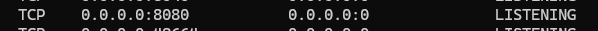
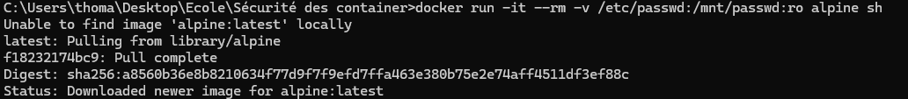
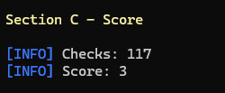
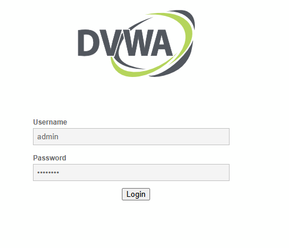
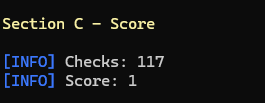
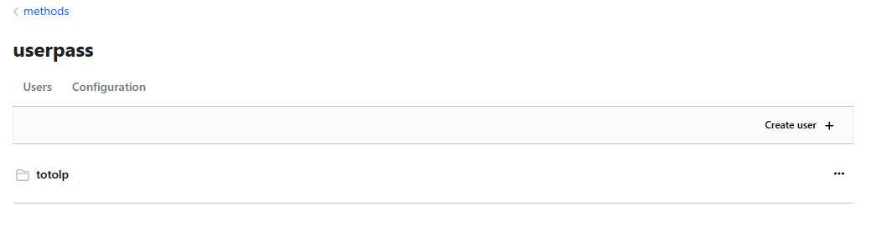
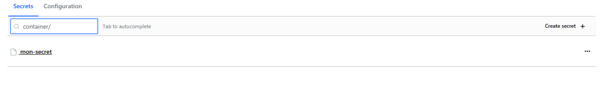
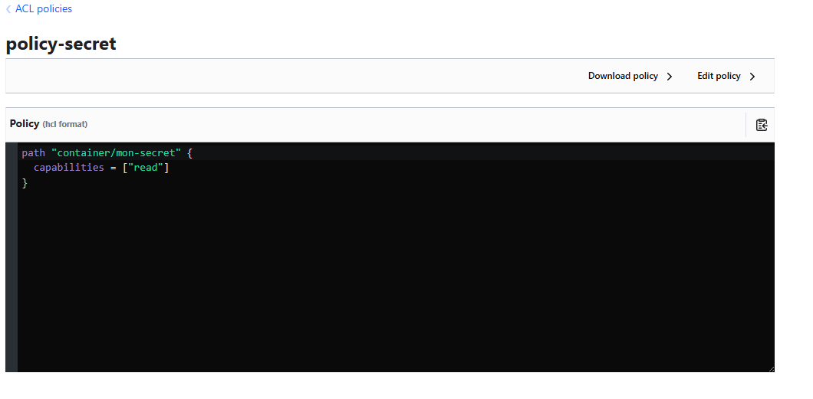
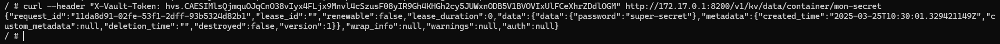
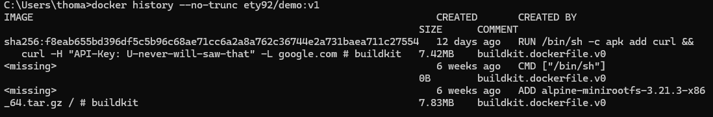

# Synthèse du TP : Sécurité Docker

## 1. Éviter l’Exposition Involontaire de Ports

### Lancer un container avec restriction de ports
```bash
docker run -d -p 8080:80 nginx
```

### Vérifier si le port est exposé
Utilisation de `netstat` ou `ss` :
```bash
netstat -tulnp | grep 8080
```

**Résultat :**



## 2. Restreindre les permissions d’accès aux fichiers sensibles

### Monter un volume avec des permissions spécifiques
```bash
docker run -it --rm -v /etc/passwd:/mnt/passwd:ro alpine sh
```

Vérifications :
```bash
cat /mnt/passwd  # Lecture du fichier
```
```bash
echo "test" >> /mnt/passwd  # Écriture dans le fichier
```

**Résultat :**


Il nous est possible de lire le fichier grâce à la permission "ro", cependant il est impossible d'écrire dedans.

## 3. Auditer la configuration d’un container avec Docker Bench

### Installation et exécution
```bash
git clone https://github.com/docker/docker-bench-security.git
cd docker-bench-security/
sh docker-bench-security.sh
```

**Résultats :**
- Score de l’audit de l’hôte : 
- Audit du container `vulnerables/web-dvwa` : 
- Score de l'audit du container : 

On peut voir grâce à l'audit du container que certains ports sont ouverts et non-protégés, il est executé en tant qu'utilisateur ROOT et les permissions sont trop élevés.

## 4. Stocker et Utiliser des Secrets

### Lancer un container Vault
```bash
docker run --cap-add=IPC_LOCK -e 'VAULT_LOCAL_CONFIG={"storage": {"file": {"path": "/vault/file"}}, "listener": [{"tcp": { "address": "0.0.0.0:8200", "tls_disable": true}}], "default_lease_ttl": "168h", "max_lease_ttl": "720h", "ui": true}' -p 8200:8200 vault:1.13.3 server
```

### Création et récupération d'un secret
- Connexion à l'UI sur `localhost:8200`
- Création d'un utilisateur et mot de passe
- Création d'une ACL pour lire un secret
- Ajout du secret sous `containers/mon-secret`
- Récupération du secret via `curl` dans un container `alpine`

**Résultat :**




Une fois connecté grâce au curl, il nous est possible de récupérer le secret voulu.



## 5. Trouver la clé API cachée dans une image Docker

### Récupérer et analyser l’image
```bash
docker pull ety92/demo:v1
```

Recherches possibles :
```bash
docker history --no-trunc ety92/demo:v1

```




### Bonne pratique pour éviter cette faille
- Ne pas inclure de clés API en dur
- Utiliser des variables d'environnement ou des fichiers `.env`
