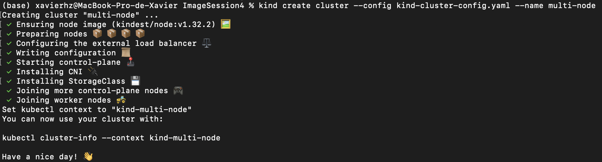
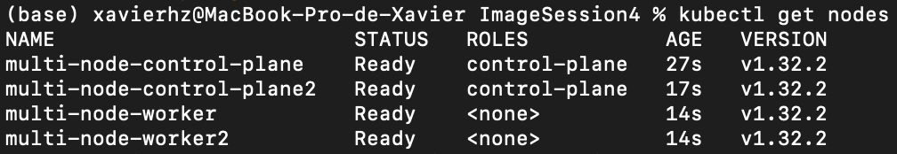
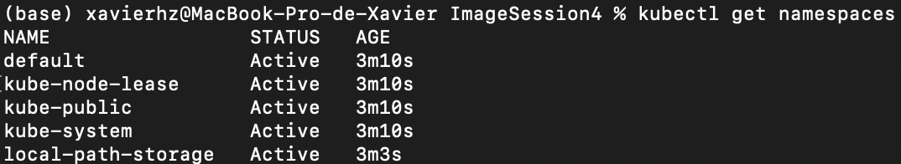
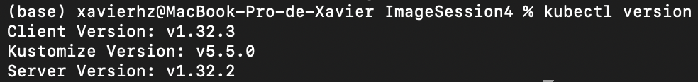
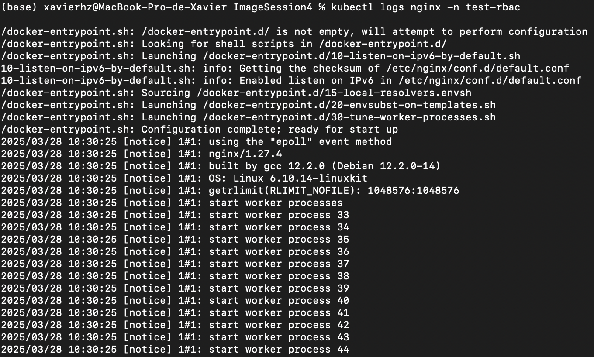
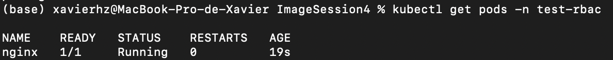

---
tags:
  - ece
  - securite
  - container
  - session 3
---

## Session 3 : Kubernetes

## Fonctionnement de Kubernetes

### Objectifs
- [x] Comprendre le fonctionnement de Kubernetes et son architecture.
- [x] Identifier les principaux composants de Kubernetes.

### Architecture de Kubernetes
Kubernetes est un orchestrateur de containers qui permet de gérer le déploiement, la mise à l'échelle et l'exploitation d'applications conteneurisées. Son architecture repose sur plusieurs composants principaux :

1. **Master Node** :  
    - **API Server** : point d'entrée principal permettant aux utilisateurs et aux outils de communiquer avec le cluster.
    - **Scheduler** : planifie l'exécution des pods sur les nœuds disponibles.
    - **Controller Manager** : supervise les différents contrôleurs de Kubernetes (gestion des replicas, des endpoints, etc.).
    - **etcd** : base de données distribuée qui stocke l'état du cluster.

2. **Worker Nodes** :  
    - **Kubelet** : agent exécuté sur chaque nœud qui gère les pods et communique avec l'API Server.
    - **Kube Proxy** : gère le routage réseau des pods.
    - **Container Runtime** : moteur d'exécution des containers (ex: containerd, cri-o, Docker).

## Sécurité des orchestrateurs

### Objectifs
- [x] Comprendre les enjeux de sécurité liés aux orchestrateurs (Kubernetes).
- [x] Appliquer des pratiques de sécurisation des orchestrateurs.

### Enjeux de sécurité des orchestrateurs

1. **Exposition des API Kubernetes** :  
    - Kubernetes expose une API REST accessible via `kubectl`. Une mauvaise configuration des accès peut permettre à des attaquants d'exécuter des commandes malveillantes sur le cluster.
    - Solution : restreindre l'accès à l'API en utilisant des contrôles RBAC stricts.

2. **Exécution de Pods non sécurisés** :  
    - Par défaut, Kubernetes permet l'exécution de pods avec des privilèges élevés.
    - Solution : utiliser des `Pod Security Standards` et éviter les containers s'exécutant en mode root.

3. **Réseau et communication inter-pods** :  
    - Par défaut, tous les pods peuvent communiquer entre eux sans restriction.
    - Solution : utiliser des `NetworkPolicies` pour limiter les communications aux seuls services nécessaires.

4. **Images et registre non sécurisés** :  
    - Utiliser des images non signées ou non scannées augmente le risque d'injection de code malveillant.
    - Solution : imposer l'utilisation d'un registre privé et scanner toutes les images avec des outils comme Trivy.

### Fonctionnement et concepts de RBAC
RBAC repose sur quatre ressources principales : Role, ClusterRole, RoleBinding et ClusterRoleBinding. Chaque élément joue un rôle précis dans la gestion des permissions au sein du cluster.

#### Role et ClusterRole
Ces deux types de ressources définissent les permissions applicables aux utilisateurs, groupes ou comptes de service.

- **Role** : Un Role est limité à un namespace spécifique. Il permet de définir des permissions sur les ressources de ce namespace uniquement. Par exemple, on peut créer un rôle qui permet à un utilisateur de lister et lire les pods dans le namespace default.  
Exemple :
  ```yaml
  apiVersion: rbac.authorization.k8s.io/v1
  kind: Role
  metadata:
    namespace: default
    name: pod-reader
  rules:
  - apiGroups: [""]
    resources: ["pods"]
    verbs: ["get", "list"]
  ```
- **ClusterRole** : Contrairement au Role, un ClusterRole est global et s'applique à toutes les ressources du cluster, quel que soit le namespace. Il est idéal pour attribuer des permissions administratives ou accéder à des ressources globales comme les nœuds ou les volumes persistants.
Exemple :
  ```yaml
  apiVersion: rbac.authorization.k8s.io/v1
  kind: ClusterRole
  metadata:
    name: pod-reader-cluster
  rules:
  - apiGroups: [""]
    resources: ["pods"]
    verbs: ["get", "list"]
  ```

#### RoleBinding et ClusterRoleBinding
Ces ressources permettent d'associer un rôle à un utilisateur, un groupe ou un compte de service.

- **RoleBinding** : Lie un Role à un utilisateur ou groupe pour un namespace donné. Il est idéal pour appliquer des permissions limitées à une équipe ou un projet spécifique.
Exemple : 
```yaml
  apiVersion: rbac.authorization.k8s.io/v1
  kind: RoleBinding
  metadata:
    name: bind-pod-reader
    namespace: default
  subjects:
  - kind: User
    name: "johndoe"  # Utilisateur à qui on attribue le rôle
    apiGroup: rbac.authorization.k8s.io
  roleRef:
    kind: Role
    name: pod-reader  # Le rôle défini précédemment
    apiGroup: rbac.authorization.k8s.io
```

- **ClusterRoleBinding** : Lie un ClusterRole à un utilisateur ou groupe à l'échelle du cluster. Utilisé pour donner des droits globaux ou accéder à des ressources hors d'un namespace.
Exemple : 
```yaml
apiVersion: rbac.authorization.k8s.io/v1
kind: ClusterRoleBinding
metadata:
  name: cluster-pod-reader-binding
subjects:
- kind: User
  name: "admin-user"  # Utilisateur avec des droits globaux
  apiGroup: rbac.authorization.k8s.io
roleRef:
  kind: ClusterRole
  name: pod-reader-cluster
  apiGroup: rbac.authorization.k8s.io
```

#### Les Verbs 
Les verbs définissent les actions autorisées sur les ressources. Voici les verbs les plus utilisés dans Kubernetes :

- **get** : Lire une ressource.
- **list** : Lister les ressources.
- **create** : Créer une ressource.
- **update** : Modifier une ressource existante.
- **delete** : Supprimer une ressource.
- **watch** : Observer les modifications sur une ressource en temps réel.
  
Ces verbs sont utilisés dans les règles des Roles et ClusterRoles pour définir précisément les actions autorisées.


### Activités Pratiques  

1. **Déployer un Cluster Kubernetes avec Kind**
   > Documentation présente [ici](https://kind.sigs.k8s.io/docs/user/quick-start/)  
    - Installer Kind
    - Installer [kubectl](https://kubernetes.io/fr/docs/tasks/tools/install-kubectl/)
    - Créer un cluster avec 2 master node et 2 worker node avec un l'aide d'un fichier yaml.

      

    - Vérifier l'état du cluster :
     ```bash
     kubectl get nodes
     ```

      

    - Comment afficher la liste des namespace ?

      

    - Quelle version de kubernetes vous avez déployé ?

      

2. **Expérimentation des RBAC**
    - Créer un namespace `test-rbac`
      ```bash
      kubectl create ns test-rbac
      ```
    - Déployer ce pod dans le namespace `test-rbac` avec la commande `kubectl apply -f mon-pod.yaml`
      ```yaml  title="mon-pod.yaml"
      apiVersion: v1
      kind: Pod
      metadata:
        name: nginx
        namespace: test-rbac
        labels:
          app: nginx
      spec:
        containers:
        - name: nginx
          image: nginx
          ports:
          - containerPort: 80
      ```

      

    - Comment afficher les logs de ce pod ?

      
    - Créer un role pour lire les pods dans le namespace `test-rbac` toujours avec la commande `kubectl apply -f`
      ```yaml  title="role-pod-reader.yaml"
      apiVersion: rbac.authorization.k8s.io/v1
      kind: Role
      metadata:
        namespace: test-rbac
        name: pod-reader
      rules:
      - apiGroups: [""]
        resources: ["pods"]
        verbs: ["get", "list"]
      ```
    - Comment afficher ce role ?
    - Ensuite il faut lier ce **Role** avec un utilisateur "fictif" `titi`, appliquer ce fichier avec `kubectl`
      ```yaml  title="rolebinding-pod-reader.yaml"
      apiVersion: rbac.authorization.k8s.io/v1
      kind: RoleBinding
      metadata:
        name: read-pods-binding
        namespace: test-rbac
      subjects:
      - kind: User
        name: titi
        apiGroup: rbac.authorization.k8s.io
      roleRef:
        kind: Role
        name: pod-reader
        apiGroup: rbac.authorization.k8s.io
      ```
    - Il faut créer l'utilisateur `titi` dans le cluster maintenant, parce que par défaut vous avez un compte admin avec les clés localisées ici `~/.kube/config`
      ```bash
      docker cp kind-control-plane:/etc/kubernetes/pki/ca.crt .
      docker cp kind-control-plane:/etc/kubernetes/pki/ca.key .
      ```  
      `kind-control-plane` est le nom du container créer par kind à adapter si besoin.  
      ```bash
      openssl genrsa -out titi.key 2048
      openssl req -new -key titi.key -out titi.csr -subj "/CN=titi"
      openssl x509 -req -in titi.csr -CA ca.crt -CAkey ca.key -CAcreateserial -out titi.crt -days 365
      ```  

    - Ajouter cet utilisateur dans le kube context  
      ```bash
      kubectl config set-credentials titi \
      --client-certificate=titi.crt \
      --client-key=titi.key
      ```  

    - Créer un contexte pour titi dans le namespace test-rbac  
      ```bash
      kubectl config set-context titi-context \
      --cluster=kind-kind \
      --namespace=test-rbac \
      --user=titi
      ```  

    - Basculer de contexte
      ```bash
      kubectl config use-context titi-context
      ```
    !!! tip
        `kubectl get ...` `kubectl apply -f monficher.yml` `kubectl logs pod monpod -n namespace`
    - Maintenant tester de lister les pods dans le namespace `test-rbac`, pouvez vous le faire ?

      
    - Pouvez-vous créer un pod dans le namespace `test-rbac` ? Si non, quel est le message d'erreur ?
    - Remettez vous dans le contexte `kind-kind`

3. **Scanner un Cluster Kubernetes avec Kube-Bench**
    - Faite un scan de votre cluster avec l'outil [kube-bench](https://aquasecurity.github.io/kube-bench/v0.9.0/)
    - Créer un job avec `kubectl apply -f job.yml` comme expliqué dans la documentation
    - Donner un rapide résumé de ce bench

!!! tip
    Pour déployer falco il faut `helm` installé sur votre machine. Helm permet de deployer des workloads dans kubernetes.

4. **Détection et alerte d'intrusions dans kubernetes avec l'outil Falco**  
    - Ajouter le repo helm et faire un update
      ```bash
      helm repo add falcosecurity https://falcosecurity.github.io/charts
      helm repo update
      ```  
    - Créer un namespace falco 
      ```bash
      kubectl create ns falco
      ```  
    - Installer la chart `falco` dans le namespace `falco` et ici on active *falcosidekick* pour avoir une UI.
      ```bash
      helm -n falco install falco falcosecurity/falco --set falcosidekick.enabled=true --set falcosidekick.webui.enabled=true
      ```
    - Vérifier que vos pods soit `running`, cela peut prendre 2 minutes
      ```bash
      kubectl get pods -n falco
      ```
    - Ouvrez un nouveau shell, dans celui ci faites un port forward afin d'afficher l'UI `http://127.0.0.1:2802` de falco dans votre navigateur 
      ```bash
      kubectl port-forward svc/falco-falcosidekick-ui 2802:2802 --namespace falco
      ```  
5. **Falco en pratique**
 
    - Il n'y a pas beaucoup d'activités sur le cluster (pod), pour y remédier on va installer un pod avec `kubectl apply -f `  
      ```yaml title="mon-pod.yml"
        apiVersion: v1
        kind: Pod
        metadata:
          labels:
            app: front
          name: front
        spec:
          containers:
          - image: alpine
            name: front
            command:
            - /bin/sh
            - -c
            - sleep 1d
      ```  

    - Executer un shell dans le pod afin de générer une alerte consultable via l'interface de falco.
      ```bash
      kubectl exec -it front -- sh
      ```
    - Est-ce que vous avez une alerte concernant cette action ? Si oui, quelle est sa priorité ? Et la règle ?

    - Toujours dans le shell du pod, générer une requête sur l'API Kubernetes
      ```bash
      apk add curl
      curl -k http://10.96.0.1:80
      ```
    - Est-ce que vous avez une alerte concernant cette action ? Si oui, quelle est sa priorité ? Et la règle ?

!!! tip
    Maintenant vous êtes des pros de Kubernetes et de la surveillance de celui-ci :fontawesome-regular-face-laugh-wink:
### Sources
- [Kubernetes Security Best Practices](https://kubernetes.io/docs/concepts/security/)
- [CIS Kubernetes Benchmark](https://www.cisecurity.org/benchmark/kubernetes)
- [Falco Activité Pratique](https://security.theodo.com/blog/falco-intrusions-kubernetes)