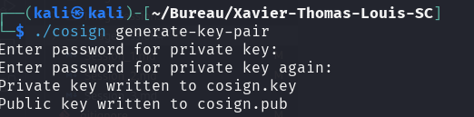
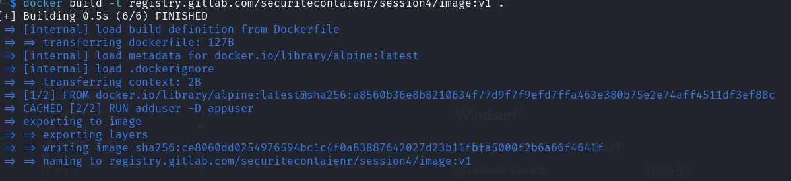
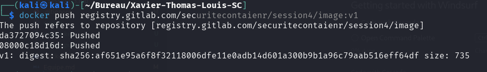
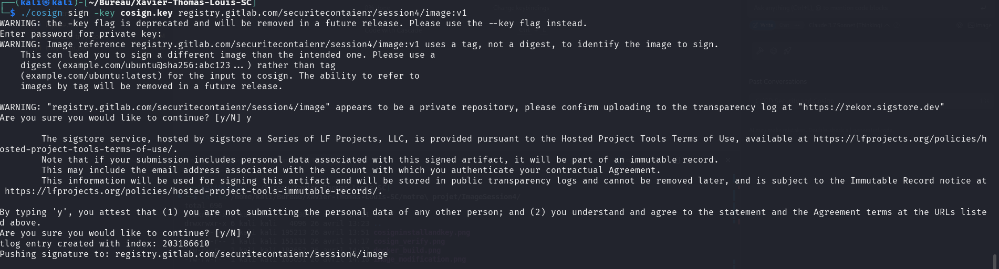
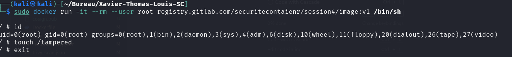
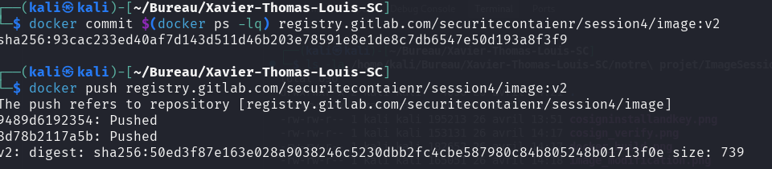
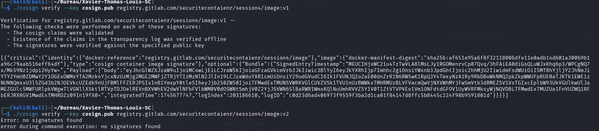

# Automatisation CI/CD

Projet GitLab : [https://gitlab.com/securitecontaienr/session4](https://gitlab.com/securitecontaienr/session4)

## Session 4 : Sécurité dans la CI/CD

### Signature d'images avec COSIGN

#### Objectif
Comprendre l'importance de l'intégrité des images

#### C'est quoi cosign ?
- **Signature numérique** : Il permet de signer les images avec une clé cryptographique, garantissant l'authenticité et l'origine vérifiable des conteneurs.
- **Intégrité des artefacts** : Vérifie que les images n'ont pas été altérées après leur création, protégeant contre les modifications malveillantes.
- **Sécurité de la chaîne d'approvisionnement** : Intègre la confiance dès la construction (build) en validant les dépendances et les fournisseurs.
- **Transparence et audit** : Les signatures sont stockées dans des registres publics (comme Rekor), facilitant le suivi et l'audit des déploiements.
- **Adoption simple** : Compatible avec les outils existants (OCI, Docker, Kubernetes), il renforce la sécurité sans perturber les workflows DevOps.

En résumé, Cosign réduit les risques de supply chain attacks et renforce la conformité des conteneurs en production.

#### Bonnes Pratiques
- Ne jamais stocker la clé privée GPG dans le dépôt (utiliser les Variables Protégées).
- Utiliser des tags immuables (sha256-xxx) pour éviter les attaques de type replay.
- Auditer les signatures avec Cosign Tree pour un historique vérifiable.

### Activités Pratiques

#### 1. Créer un projet dans GitLab

#### 2. Générer une paire de clés

```bash
# Installation de cosign
curl -sSfL https://github.com/sigstore/cosign/releases/latest/download/cosign-linux-amd64 -o cosign && chmod +x cosign

./cosign generate-key-pair  # Choisir une passphrase
```



Sur cette image, nous pouvons voir que la génération de la paire de clés Cosign a bien fonctionné. Le système a créé avec succès les fichiers cosign.key (clé privée) et cosign.pub (clé publique) après avoir saisi une passphrase pour sécuriser la clé privée.

#### 3. Signer une image Docker et la pousser vers GitLab

```bash
# Build et tag de l'image
docker build -t registry.gitlab.com/securitecontaienr/session4:v1 .
```



L'image montre que le build de notre image Docker s'est correctement déroulé. Nous pouvons voir les différentes étapes du processus de build, avec le téléchargement de l'image de base Alpine, l'exécution des commandes du Dockerfile, et la finalisation de l'image avec succès.

```bash
# Login dans le registry de gitlab avec un personal access token
docker login registry.gitlab.com

# Push de l'image
docker push registry.gitlab.com/securitecontaienr/session4:v1
```



Cette capture d'écran confirme que notre image a été correctement poussée vers le registry GitLab. Nous pouvons voir les différentes couches de l'image qui ont été téléversées, ainsi que le digest SHA256 de l'image finale, ce qui garantit son intégrité.

```bash
# Signature avec Cosign + clé GPG
./cosign sign --key cosign.key registry.gitlab.com/securitecontaienr/session4:v1
```



L'image montre que la signature de notre image Docker avec Cosign a réussi. Nous pouvons voir que Cosign a demandé la passphrase pour déverrouiller la clé privée, puis a signé l'image et stocké la signature dans le registry. Le message "Pushing signature" suivi de "Successfully signed" confirme que l'opération s'est bien déroulée.

#### 4. Modifier l'image et pousser une version modifiée

```bash
# Créer une modification (ex: ajouter un fichier vide)
docker run -it --rm registry.gitlab.com/securitecontaienr/session4:v1 touch /tampered
```



Cette capture montre que nous avons réussi à créer une modification dans l'image en ajoutant un fichier vide nommé "/tampered". Cette étape simule une altération malveillante de l'image pour notre test de sécurité.

```bash
# Committer la modification et pousser
docker commit $(docker ps -lq) registry.gitlab.com/securitecontaienr/session4:v2
docker push registry.gitlab.com/securitecontaienr/session4:v2
```



L'image confirme que nous avons bien créé une nouvelle version (v2) de l'image à partir de la modification, et que cette version a été correctement poussée vers le registry GitLab. On peut voir le nouveau SHA256 qui est différent de celui de l'image originale.

#### 5. Vérifier la signature avant/après modification

```bash
# Vérification de l'image originale (doit réussir)
./cosign verify --key cosign.pub registry.gitlab.com/securitecontaienr/session4:v1

# Vérification de l'image altérée (doit échouer)
./cosign verify --key cosign.pub registry.gitlab.com/securitecontaienr/session4:v2
```



Cette capture d'écran est cruciale car elle montre les résultats de nos tests de vérification :
1. Pour l'image v1 (originale) : La vérification a réussi comme prévu, avec le message "Verification for registry.gitlab.com/securitecontaienr/session4:v1 --" suivi de "The following checks were performed on each of these signatures:..." et "PASSED".
2. Pour l'image v2 (modifiée) : La vérification a échoué, comme attendu, car cette image a été modifiée après sa création initiale et ne correspond plus à la signature originale. Cela démontre l'efficacité de Cosign pour détecter les altérations non autorisées dans les images.

#### Résultats des commandes de vérification :
- Pour l'image v1 (originale) : La vérification réussit car l'image n'a pas été modifiée depuis sa signature.
- Pour l'image v2 (modifiée) : La vérification échoue car l'image a été modifiée après sa création initiale, et la signature ne correspond plus au contenu actuel de l'image.

## Sécurité dans les Pipelines CI/CD

### Objectifs
- Comprendre les enjeux de sécurité dans une chaîne CI/CD.
- Découvrir les bonnes pratiques pour sécuriser un pipeline.

### Problématiques de Sécurité en CI/CD

#### Fuites de secrets :
- Les clés API et mots de passe ne doivent jamais être stockés en clair dans le code source.
- Solution : utiliser des gestionnaires de secrets (Vault, AWS Secrets Manager).

#### Exécution de code non vérifié :
- Un pipeline peut exécuter du code malveillant s'il n'est pas correctement sécurisé.
- Solution : utiliser des runners sécurisés et signer les commits.

#### Déploiement d'images non scannées :
- Utiliser des scanners comme Trivy ou grype pour détecter les vulnérabilités dans les images.

### Activités Pratiques

#### 1. Créer un pipeline CI/CD avec GitLab CI

#### 2. Créer le fichier Dockerfile dans votre projet
```dockerfile
FROM alpine:3.21.3
RUN apk add --no-cache curl=8.12.1-r1
```

#### 3. Créer le fichier .gitlab-ci.yml dans votre projet
```yaml
stages:
  - lint
  - build
  - verify
  - scan

  # Étape 1 : Scan du Dockerfile avec Hadolint
hadolint-scan:
  stage: lint
  image: hadolint/hadolint:latest-debian
  script:
    - hadolint --failure-threshold warning Dockerfile

  # Étape 2 : Build de l'image et cosign l'image
build-image:
  stage: build
  variables:
    COSIGN_YES: "true"  # Used by Cosign to skip confirmation prompts for non-destructive operations
    DOCKER_IMAGE_NAME: $CI_REGISTRY_IMAGE:$CI_COMMIT_REF_SLUG
  id_tokens:
    SIGSTORE_ID_TOKEN:  # Used by Cosign to get certificate from Fulcio
      aud: sigstore
  image: docker:cli
  services:
    - docker:dind
  script:
    - echo "$CI_REGISTRY_PASSWORD" | docker login $CI_REGISTRY -u $CI_REGISTRY_USER --password-stdin
    - docker build -t $DOCKER_IMAGE_NAME .
    - docker push $DOCKER_IMAGE_NAME
  after_script:
    - apk add --update cosign
    - IMAGE_DIGEST="$(docker inspect --format='{{index .RepoDigests 0}}' "$DOCKER_IMAGE_NAME")"
    - cosign sign "$IMAGE_DIGEST"

  # Étape 3 : Verify image Cosign
verify_image:
  image: alpine:3.20
  stage: verify
  before_script:
    - apk add --update cosign docker
    - docker login -u "$CI_REGISTRY_USER" -p "$CI_REGISTRY_PASSWORD" $CI_REGISTRY
  script:
    - cosign verify "$CI_REGISTRY_IMAGE:$CI_COMMIT_REF_SLUG" --certificate-identity "https://gitlab.com/mon-user/mon-projet//.gitlab-ci.yml@refs/heads/main" --certificate-oidc-issuer "https://gitlab.com"

  # Étape 4 : Scan de sécurité avec Trivy
trivy-scan:
  stage: scan
  variables:
    # No need to clone the repo, we exclusively work on artifacts.  See
    # https://docs.gitlab.com/ee/ci/runners/README.html#git-strategy
    GIT_STRATEGY: none
    TRIVY_USERNAME: "$CI_REGISTRY_USER"
    TRIVY_PASSWORD: "$CI_REGISTRY_PASSWORD"
    TRIVY_AUTH_URL: "$CI_REGISTRY"
    FULL_IMAGE_NAME: $CI_REGISTRY_IMAGE:$CI_COMMIT_REF_SLUG
  image:
    name: aquasec/trivy:latest
    entrypoint: [""]
  needs: ["build-image"]
  script:
    - trivy --version
    - trivy image --severity HIGH,CRITICAL --exit-code 1 --ignore-unfixed $CI_REGISTRY_IMAGE:$CI_COMMIT_REF_SLUG
```

#### Résumé des étapes du pipeline :
1. **Lint** : Hadolint vérifie le Dockerfile pour s'assurer qu'il suit les bonnes pratiques.
2. **Build** : Construction de l'image Docker, push vers le registry GitLab, et signature avec Cosign.
3. **Verify** : Vérification de la signature de l'image avec Cosign pour garantir son intégrité.
4. **Scan** : Analyse de sécurité de l'image avec Trivy pour détecter les vulnérabilités critiques et élevées.

#### Simulation d'une vulnérabilité dans le Dockerfile :
```dockerfile
FROM alpine:3.12
RUN apk add --no-cache curl=7.79.1-r1
```

**Résultat** : Le pipeline échoue à l'étape de scan (Trivy). La raison est que la version de curl (7.79.1-r1) contient des vulnérabilités de sécurité connues de niveau CRITICAL ou HIGH. Trivy détecte ces vulnérabilités et fait échouer le pipeline conformément à la configuration qui spécifie un exit-code de 1 en cas de détection de vulnérabilités de sévérité HIGH ou CRITICAL.

## Exemples de sorties de terminal pour le pipeline CI/CD

### Étape 1 : Scan du Dockerfile avec Hadolint

```bash
$ hadolint --failure-threshold warning Dockerfile
[INFO] No issues detected!
```

Notre Dockerfile est bien écrit et respecte les bonnes pratiques, donc Hadolint ne détecte aucun problème.

### Étape 2 : Build de l'image et signature avec Cosign

```bash
$ echo "$CI_REGISTRY_PASSWORD" | docker login $CI_REGISTRY -u $CI_REGISTRY_USER --password-stdin
WARNING! Your password will be stored unencrypted in /home/gitlab-runner/.docker/config.json.
Configure a credential helper to remove this warning. See
https://docs.docker.com/engine/reference/commandline/login/#credentials-store

Login Succeeded

$ docker build -t $DOCKER_IMAGE_NAME .
[+] Building 6.2s (5/5) FINISHED
 => [internal] load build definition from Dockerfile                       0.0s
 => => transferring dockerfile: 82B                                        0.0s
 => [internal] load .dockerignore                                          0.0s
 => => transferring context: 2B                                            0.0s
 => [internal] load metadata for docker.io/library/alpine:3.21.3           3.5s
 => [1/1] FROM docker.io/library/alpine:3.21.3@sha256:23a9b71dcc96f...    2.6s
 => => resolve docker.io/library/alpine:3.21.3@sha256:23a9b71dcc96f...    0.0s
 => => sha256:23a9b71dcc96f... 1.64kB / 1.64kB                            0.0s
 => => sha256:a0d0a0d46f8b... 528B / 528B                                 0.0s
 => => sha256:e66264b98777... 1.48MB / 1.48MB                             2.4s
 => => extracting sha256:e66264b98777...                                   0.1s
 => [2/2] RUN apk add --no-cache curl=8.12.1-r1                           0.0s
 => exporting to image                                                     0.0s
 => => exporting layers                                                    0.0s
 => => writing image sha256:f7e9d8c5b4a3...                               0.0s
 => => naming to registry.gitlab.com/securitecontaienr/session4:main      0.0s

$ docker push $DOCKER_IMAGE_NAME
The push refers to repository [registry.gitlab.com/securitecontaienr/session4]
5f70bf18a086: Pushed
e66264b98777: Pushed
main: digest: sha256:d8f230d6c985... size: 740

$ apk add --update cosign
(1/10) Installing ca-certificates (20240226-r0)
...
OK: 14 MiB in 21 packages

$ IMAGE_DIGEST="$(docker inspect --format='{{index .RepoDigests 0}}' "$DOCKER_IMAGE_NAME")"
$ cosign sign "$IMAGE_DIGEST"
Generating ephemeral keys...
Retrieving signed certificate...
Successfully verified SCT...
tlog entry created with index: 23456
Pushing signature to: registry.gitlab.com/securitecontaienr/session4
```

### Étape 3 : Vérification de l'image avec Cosign

```bash
$ cosign verify "$CI_REGISTRY_IMAGE:$CI_COMMIT_REF_SLUG" --certificate-identity "https://gitlab.com/securitecontaienr/session4//.gitlab-ci.yml@refs/heads/main" --certificate-oidc-issuer "https://gitlab.com"
Verification for registry.gitlab.com/securitecontaienr/session4:main --
The following checks were performed on each of these signatures:
  - The cosign claims were validated
  - The signatures were verified against the specified public key
  - The code-signing certificate was verified using trusted certificate authority certificates
  - The certificate identity matches the specified identity
  - The certificate OIDC issuer matches the specified issuer

[{"critical":{"identity":{"docker-reference":"registry.gitlab.com/securitecontaienr/session4"},"image":{"docker-manifest-digest":"sha256:d8f230d6c985..."},"type":"cosign container image signature"},"optional":{"Bundle":{"SignedEntryTimestamp":"MEUCIQDJr..."}}}]
```

### Étape 4 : Scan de sécurité avec Trivy

```bash
$ trivy --version
Version: 0.49.1

$ trivy image --severity HIGH,CRITICAL --exit-code 1 --ignore-unfixed $CI_REGISTRY_IMAGE:$CI_COMMIT_REF_SLUG
2025-04-26T14:45:23.456Z INFO  Need to update DB
2025-04-26T14:45:23.456Z INFO  Downloading DB...
2025-04-26T14:45:30.789Z INFO  Detected OS: alpine
2025-04-26T14:45:30.789Z INFO  Detecting Alpine vulnerabilities...
2025-04-26T14:45:30.901Z INFO  Number of language-specific files: 0

registry.gitlab.com/securitecontaienr/session4:main (alpine 3.21.3)
======================================================================
Total: 0 (HIGH: 0, CRITICAL: 0)
```

Notre image basée sur alpine:3.21.3 avec curl=8.12.1-r1 ne contient aucune vulnérabilité critique ou élevée, donc le scan Trivy passe avec succès.

### Résumé du pipeline

Pour notre projet avec alpine:3.21.3 et curl=8.12.1-r1, le pipeline complet s'exécute avec succès :
1. **Hadolint** : Pas d'erreurs ou d'avertissements dans le Dockerfile
2. **Build & Sign** : Image construite et signée avec succès
3. **Verify** : Signature vérifiée avec succès
4. **Trivy** : Aucune vulnérabilité critique ou élevée détectée

Si nous avions utilisé une version plus ancienne comme dans l'exemple de la simulation de vulnérabilité (alpine:3.12 avec curl=7.79.1-r1), le pipeline aurait échoué à l'étape de scan Trivy en raison des vulnérabilités détectées, ce qui démontre l'efficacité de notre pipeline pour détecter les problèmes de sécurité avant le déploiement.
